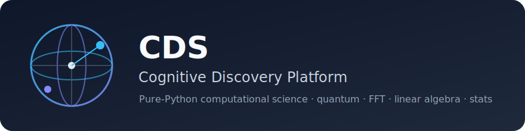

<p align="center">
  
</p>

# cognitive-discovery-platform

[](https://pypi.org/project/cognitive-discovery-platform/)
[](https://pypi.org/project/cognitive-discovery-platform/)
[](https://www.python.org/downloads/)
[](https://peps.python.org/pep-0561/)
[](https://codecov.io/gh/Furox88/cognitive-discovery-system)
[](LICENSE)
[](https://github.com/Furox88/cognitive-discovery-system/actions/workflows/tests.yml)
[](https://furox88.github.io/cognitive-discovery-system/)
[](https://github.com/Furox88/cognitive-discovery-system)

**Open-source computational science platform for research, simulation, and discovery.**

CDS brings together quantum computing simulation, statistical analysis, signal processing, optimization, probability, and scientific computing in a single, dependency-light Python package. Every module is pure Python — no NumPy or SciPy required.

The platform also includes built-in support for structured hypothesis generation, making it easier to explore ideas and connect them to simulation or analysis tools.

> **v1.0.4 stable release.** Contributions welcome!

📚 **[Documentation](https://Furox88.github.io/cognitive-discovery-system/)** | 🧪 **[Tutorials](docs/tutorials/)** | 🚀 **[Quick Start](docs/tutorials/quick_start.md)**

---
🚀 **Latest Update:** **v1.0.4 stable** — the `cds.nlp` module ships educational, from-scratch implementations of modern NLP building blocks: BPE tokenization, sinusoidal embeddings, scaled dot-product / multi-head attention, a Transformer block, a scalar reverse-mode autograd engine with SGD/Adam, and a MiniGPT training demo. Plus an NLP visualisation toolkit (attention heatmap, PCA projection, training curves). All in readable pure Python, with **883 tests** and **99.48%** coverage.
---

## Contents

- [Why CDS?](#why-cds)
- [Citing CDS](#citing-cds)
- [Modules](#modules)
- [Quick Start](#quick-start)
- [Intelligence over Brute Force](#-intelligence-over-brute-force)
- [ASCII Visualization & Tools](#-ascii-visualization--tools)
- [Interactive Dashboard](#-interactive-dashboard)
- [Scientific Case Studies](#-scientific-case-studies)
- [Examples](#examples)
- [Architecture](#architecture)
- [Vision](#vision)
- [Recent Improvements](#recent-improvements)
- [Contributing](#contributing)
- [Automation and Maintenance Workflows](#automation-and-maintenance-workflows)
- [License](#license)
- [Contact](#contact)

---

## Why CDS?

- **Zero heavy dependencies** — pure Python implementations you can read and learn from
- **Quantum simulation** — single & multi-qubit circuits with entanglement
- **Built for discovery** — hypothesis generation with structured outputs (assumptions, predictions, confidence) plus a Protocol for custom implementations
- **Broad scope** — 16 modules covering math, physics, stats, ML, signals, optimization, graph theory, ODEs, numerical integration, Monte Carlo, and educational NLP (BPE + embeddings)
- **883 tests** (see CI) — thoroughly tested with **~99% code coverage**
- **Practical automation** — workflows for PR checklists, dependency updates, and releases to keep maintenance manageable

### CDS vs other libraries

| Need | CDS | NumPy/SciPy | SymPy | PennyLane |
|---|---|---|---|---|
| Pure-Python (no compile, no binary) | ✅ | ❌ (C/Fortran) | ✅ | ❌ (needs Qiskit/Cirq) |
| Quantum simulation | ✅ single/multi-qubit | ❌ | minimal | ✅ full SDK |
| Hypothesis generation (structured) | ✅ | ❌ | ❌ | ❌ |
| Educational NLP (BPE, embeddings) | ✅ from-scratch | ❌ | ❌ | ❌ |
| Single-package umbrella (math+physics+stats+ML+signals+NLP) | ✅ | ❌ split across 6+ | partial | ❌ focused |
| Production-ready CI/CD (multi-OS matrix, signed releases) | ✅ | n/a | partial | ✅ |
| Educational / readable source | ✅ | ❌ large surface | ✅ | ❌ |
| Edge runtime (no BLAS) | ✅ | ❌ | partial | ❌ |
| Heavy numerical performance (>10⁷ ops) | ❌ use NumPy instead | ✅ | ❌ | ✅ (GPU) |

**When to use CDS:** teaching, prototyping, scientific exploration, edge deployments, custom algorithm development.
**When to reach for NumPy/SciPy/PennyLane:** production HPC, GPU-accelerated quantum, distributed compute.
- **CLI included** — interactive tools, demos, and ASCII visualization from your terminal

## Citing CDS

If CDS is useful in your research or publications, please cite it using the information in `CITATION.cff` at the repository root. This helps give proper credit and track adoption in scientific work.

## Modules

| Module | Description |
|--------|-------------|
| `cds.quantum` | Single & multi-qubit simulation — Hadamard, Pauli, CNOT, SWAP, Toffoli, Bell/GHZ states, entanglement detection |
| `cds.optimization` | Gradient descent, Newton's method, Adam optimizer, golden section search |
| `cds.ml` | **NEW:** Pure Python Neural Networks — MLP, dense layers, Adam-based training |
| `cds.signals` | DFT, radix-2 FFT/IFFT (O(N log N)), 2D FFT/IFFT, convolution, power spectrum, filtering |
| `cds.probability` | Gaussian, uniform, exponential, binomial, Poisson distributions |
| `cds.stats` | Descriptive stats, Pearson correlation, linear regression, t-test, chi-square, ANOVA |
| `cds.math_utils` | Numerical calculus, O(N³) LU / QR / Cholesky, eigenvalue (power iteration), Gram-Schmidt, matrix inverse |
| `cds.data_analysis` | **NEW:** Mini-Pandas `DataSet` for filtering/grouping, CSV loading, ASCII visualization |
| `cds.scientific` | Physical constants, formulas (KE, gravity, gas law, Schwarzschild, de Broglie, escape velocity) |
| `cds.graph` | BFS, DFS, Dijkstra shortest path, Kruskal MST, topological sort, cycle detection |
| `cds.montecarlo` | Monte Carlo integration, π estimation, Buffon's needle, random walks (1D/2D) |
| `cds.diffeq` | Euler method, RK4, midpoint method, ODE system solver |
| `cds.numerical_integration` | **NEW:** Deterministic quadrature — trapezoid, Simpson 1/3 & 3/8, Romberg, Gauss-Legendre, adaptive Simpson |
| `cds.nlp` | **NEW:** Educational NLP from scratch — BPE tokenizer, sinusoidal embeddings, multi-head attention, Transformer block, scalar autograd (SGD/Adam), MiniGPT demo |
| `cds.hypothesis` | Structured hypothesis generation with prompt templates for custom research workflows |

## Quick Start

```bash
git clone https://github.com/Furox88/cognitive-discovery-system.git
cd cognitive-discovery-system
python -m venv .venv
source .venv/bin/activate
pip install -e ".[dev]"

# Run tests
pytest

# CLI usage
cds --help
cds constants
cds calc ke
cds modules
cds hypothesis "What causes the Hubble tension?"
```

## 🧠 Intelligence over Brute Force

CDS is built on the philosophy that **smart algorithms beat brute force**. While pure Python cannot match C-extensions in raw loop speed, CDS closes the gap with mathematical intelligence:

- **Quantum Simulation:** Instead of multiplying massive matrices for every shot, CDS uses **O(1) probabilistic sampling** with true state collapse, making it millions of times faster than naive approaches.
- **Linear Algebra:** Replaced standard O(N!) determinants with **O(N³)** Partial Pivoting LU Decomposition.
- **Signal Processing:** Uses zero-padded **O(N log N)** FFT and FFT-based Convolution Theorems.
- **Neural Networks:** Features Adam optimizers with momentum state persistence.

See the full [Intelligence & Performance Benchmark Report](docs/benchmarks.md) for detailed figures.

## 📊 ASCII Visualization & Tools

You don't need heavy plotting libraries to see your data. CDS includes a built-in terminal visualization engine:

```bash
# Plot a sine wave or data series directly in your terminal!
cds plot "1, 5, 3, 8, 4, 9" --title "My Data"
```
*Outputs clean, scale-aware ASCII line plots and bar charts.*

## 🌐 Interactive Dashboard

CDS now features an **Interactive Web Dashboard** for real-time scientific exploration. Launch it directly from your terminal:

```bash
pip install "cognitive-discovery-platform[dashboard]"
cds dashboard
```

*The dashboard includes a live Hypothesis Engine, Quantum Circuit Simulator, Neural Network training visualizer, and Statistical testing lab.*

## 🧪 Scientific Case Studies

Explore how CDS is used to solve real-world research problems:

1.  [**Hubble Tension Analysis**](docs/CASE_STUDY_HUBBLE.md): Generating and testing hypotheses for the expansion rate of the universe.
2.  [**Quantum-ML Integration**](docs/CASE_STUDY_QUANTUM_ML.md): Using quantum circuit measurements as features for classical Neural Network training.

## Examples


See the [`examples/`](examples/) directory for runnable demos and `docs/research-workflows.md` for guidance on embedding CDS in research pipelines.

### Hypothesis Generation (cognitive discovery)

```bash
# Basic demo
python examples/hypothesis_demo.py

# With stats / experiment sketch example
python examples/hypothesis_with_stats_demo.py

# Custom generator implementation (using the HypothesisGenerator Protocol)
python examples/hypothesis_custom_generator.py

# Or via CLI
cds hypothesis "What causes the Hubble tension?"
```

### Quantum Circuit (single qubit)
```python
from cds.quantum import QuantumCircuit, hadamard, pauli_x, simulate

circuit = QuantumCircuit().add(hadamard()).add(pauli_x())
result = circuit.run()
print(result.probabilities())

counts = simulate(circuit, shots=1000)
print(counts)  # {0: ~500, 1: ~500}
```

### Multi-Qubit & Entanglement
```python
from cds.quantum import (
    QuantumRegister, h_gate, cnot, bell_state,
    ghz_state, is_entangled,
)

# Bell state (|00⟩ + |11⟩) / √2
reg = bell_state(0)
print(is_entangled(reg))  # True
print(reg.measure_shots(shots=1000))  # {'00': ~500, '11': ~500}

# 4-qubit GHZ state
ghz = ghz_state(4)
counts = ghz.measure_shots(shots=1000)
print(counts)  # {'0000': ~500, '1111': ~500}
```

### Optimization
```python
from cds.optimization import gradient_descent, newton_method

# Find minimum of (x-3)²
result = gradient_descent(lambda x: (x - 3) ** 2, x0=10.0, lr=0.1)
print(f"x = {result.x:.6f}")  # ~3.0

# Find √2 using Newton's method
result = newton_method(lambda x: x ** 2 - 2, x0=1.5)
print(f"√2 = {result.x:.10f}")  # 1.4142135624
```

### Signal Processing
```python
from cds.signals import dft, fft_radix2, convolve, low_pass_filter

# FFT of a signal
signal = [complex(i) for i in range(8)]
spectrum = fft_radix2(signal)

# Convolution
result = convolve([1.0, 2.0, 3.0], [0.5, 0.5])
print(result)  # [0.5, 1.5, 2.5, 1.5]
```

### Probability Distributions
```python
from cds.probability import gaussian_pdf, binomial_pmf, poisson_pmf

# Gaussian PDF at x=0
print(gaussian_pdf(0.0, mu=0, sigma=1))  # 0.3989...

# Binomial: P(3 heads in 5 fair flips)
print(binomial_pmf(3, 5, 0.5))  # 0.3125

# Poisson: P(k=2, λ=3)
print(poisson_pmf(2, 3.0))  # 0.2240...
```

### Statistics
```python
from cds.stats import mean, stdev, correlation, linear_regression

data = [12.5, 14.3, 11.8, 15.1, 13.7]
print(f"mean={mean(data):.2f}, std={stdev(data):.2f}")

x = [1, 2, 3, 4, 5]
y = [2.1, 3.9, 6.2, 7.8, 10.1]
reg = linear_regression(x, y)
print(f"y = {reg.slope:.2f}x + {reg.intercept:.2f}, R²={reg.r_squared:.3f}")
```

### Machine Learning
```python
from cds.ml import Layer, MLP

# Simple XOR-like Neural Network
net = MLP([
    Layer(2, 4, activation="relu"),
    Layer(4, 1, activation="sigmoid")
])
X, y = [[0, 0], [0, 1], [1, 0], [1, 1]], [[0], [1], [1], [0]]

# Train with built-in Adam optimizer
history = net.train(X, y, epochs=50, lr=0.1)
print(f"Final loss: {history['final_loss']:.4f}")
```

### Data Analysis & Visualization
```python
from cds.data_analysis import DataSet, plot_bar

# Mini-Pandas DataSet for filtering and grouping
data = [{"name": "A", "score": 88}, {"name": "B", "score": 92}]
ds = DataSet(data)
filtered = ds.filter(lambda row: row["score"] > 90)
print(filtered.column("name"))  # ['B']

# Terminal Visualization
scores = {row["name"]: row["score"] for row in ds.to_list()}
print(plot_bar(scores, title="Scores"))
```

### Scientific Computing
```python
from cds.scientific import kinetic_energy, escape_velocity, get_constant

print(get_constant("c"))          # speed of light
print(kinetic_energy(10, 5))      # 125.0 J
print(escape_velocity(5.972e24, 6.371e6))  # ~11186 m/s
```

### Graph Theory
```python
from cds.graph import Graph, dijkstra, kruskal_mst, bfs

g = Graph(n_vertices=4, directed=False)
g.add_edge(0, 1, 1.0)
g.add_edge(1, 2, 2.0)
g.add_edge(2, 3, 3.0)
g.add_edge(0, 3, 10.0)

dist, prev = dijkstra(g, 0)
print(dist)  # {0: 0.0, 1: 1.0, 2: 3.0, 3: 6.0}

edges, total = kruskal_mst(g)
print(f"MST weight: {total}")  # 6.0
```

### Monte Carlo Simulation
```python
import math
from cds.montecarlo import estimate_pi, mc_integrate

if __name__ == "__main__":
    # Unit-circle method
    result = estimate_pi(n_samples=100_000, seed=42)
    print(f"PI approximation: {result.estimate:.4f}")

    # Integration
    area = mc_integrate(math.sin, 0, math.pi, n_samples=100_000)
    print(f"Integral of sin(x): {area.estimate:.4f}")
```

### Differential Equations
```python
from cds.diffeq import rk4, solve_system
import math

# dy/dt = -y, y(0)=1  =>  y(t) = e^(-t)
sol = rk4(lambda t, y: -y, t0=0, y0=1.0, t_end=2.0)
print(f"y(2) = {sol.y[-1]:.6f}")  # ~0.135335 (e^-2)

# Harmonic oscillator: x'' = -x
def harmonic(t, y):
    return [y[1], -y[0]]
t_vals, y_vals = solve_system(harmonic, 0, [1.0, 0.0], math.pi)
print(f"x(π) = {y_vals[-1][0]:.4f}")  # ~-1.0
```

### Numerical Integration
```python
import math
from cds.numerical_integration import simpson, gaussian_quadrature, romberg

# ∫_0^π sin(x) dx = 2
print(simpson(math.sin, 0, math.pi, n=100))  # ~2.0, O(h⁴)

# Gauss-Legendre: exact for polynomials up to degree 2n-1
print(gaussian_quadrature(lambda x: x**7, 0, 1, n=4))  # 0.125 (exact)

# Romberg reaches full machine precision on smooth integrands
result = romberg(math.exp, 0, 1, tol=1e-12)
print(f"∫e^x = {result.value:.10f}")  # ~1.7182818285
```

## Architecture

```
src/cds/
├── quantum/        # Quantum circuit simulation (single & multi-qubit)
├── optimization/   # Gradient descent, Newton, Adam, line search
├── ml/             # Neural Networks (MLP, Layers, Adam training)
├── signals/        # DFT, FFT, convolution, filtering
├── probability/    # Probability distributions & sampling
├── stats/          # Statistical analysis & regression
├── math_utils/     # Calculus, linear algebra, eigenvalues, Gram-Schmidt
├── data_analysis/  # Mini-Pandas DataSet, CSV loading, ASCII viz
├── scientific/     # Physical constants & formulas
├── graph/          # Graph algorithms (Dijkstra, BFS, DFS, Kruskal MST)
├── montecarlo/     # Monte Carlo methods (π, integration, random walks)
├── diffeq/         # ODE solvers (Euler, RK4, midpoint)
├── numerical_integration/  # Deterministic quadrature (trapezoid, Simpson, Romberg, Gauss-Legendre)
├── nlp/            # Educational NLP (BPE, embeddings, attention, autograd, MiniGPT)
├── hypothesis/     # Hypothesis generation
├── core/           # Shared models, config
└── cli.py          # Command-line interface

examples/           # Runnable demo scripts
tests/              # 883 tests (see CI)
docs/               # MkDocs documentation, tutorials, benchmarks
```

.github/workflows/  # Automation for PRs (labels + checklist), releases, and dependency updates
```

## Vision

The long-term goal of CDS is to provide a lightweight, dependency-free platform for scientific exploration and discovery.

We aim to combine solid numerical foundations (quantum simulation, FFT, linear algebra, statistics, differential equations, etc.) with higher-level tools for hypothesis generation and research workflows.

A distinctive part is the `cds.hypothesis` module, which generates structured, falsifiable hypotheses with explicit assumptions and predictions. The `cds hypothesis` CLI command and `examples/hypothesis_demo.py` make this side immediately usable. Recent work has focused on making the CLI and docs more practical for day-to-day use while keeping everything readable pure Python.

The project is still early but is being actively developed with a focus on code quality, test coverage, documentation, and usability for researchers and students.

Run `cds modules` after installation to explore the current modules.

## Recent improvements

Recent updates have aimed to make it simpler to generate and explore ideas within the platform:

- New CLI commands for browsing available modules and experimenting with hypothesis generation
- A dedicated example showing how to use the hypothesis features end-to-end
- Automation around pull requests, dependency management, and releases to free up time for core scientific work

The goal is to lower the barrier for using the discovery-oriented parts of the project and reduce time spent on routine tasks.

## Contributing

See [CONTRIBUTING.md](CONTRIBUTING.md) for setup and guidelines.

Looking for:
- Researchers with domain expertise
- People interested in pure-Python scientific computing
- Contributors for new modules (ML basics, PDE solvers, etc.)
- People who want to help make scientific tools easier to maintain and use


## Automation and Maintenance Workflows

A few GitHub Actions handle repetitive aspects of keeping the project running:

- Dependabot for regular updates to dependencies and GitHub Actions
- Automatic labeling and review checklists for pull requests
- A release process that builds and publishes on version tags

These help ensure that time spent on the project goes more toward developing new modules, improving hypothesis tools, and supporting research use cases rather than manual upkeep.

See `.github/workflows/` for the current setup.

## License

MIT — see [LICENSE](LICENSE).

## Contact

- Maintainer: [@Furox88](https://github.com/Furox88)
- Issues & Discussions: [GitHub](https://github.com/Furox88/cognitive-discovery-system/issues)


## Why These Automations Exist

The project is maintained by a small team (often solo). The workflows above exist so that routine tasks (labeling PRs, running checks, cutting releases, keeping dependencies fresh) take as little time as possible. This frees hours for actual research work: improving the hypothesis tools, adding new scientific modules, writing better examples, and exploring new discovery workflows.

If you're a researcher or educator using CDS, these automations mean you can focus on the science instead of repo housekeeping.
